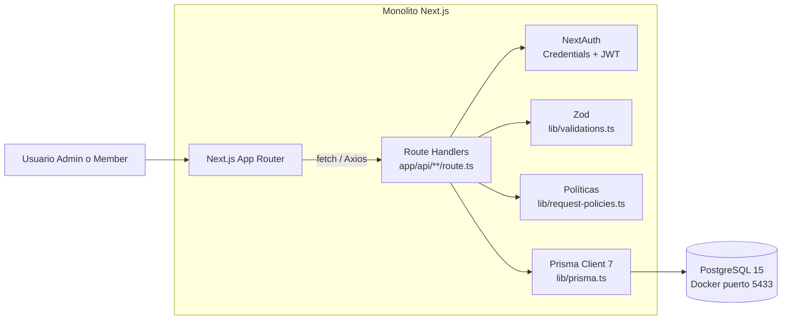
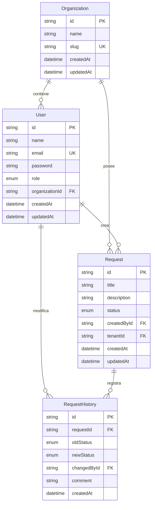
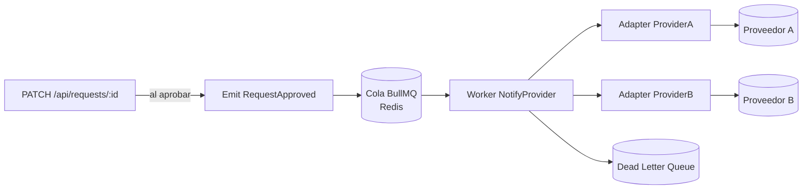

# Arquitectura — BluePixel MVP

Este documento describe la arquitectura implementada actualmente en el MVP de gestión B2B de solicitudes. También documenta las decisiones técnicas, la deuda aceptada y la evolución prevista del sistema.

## 1. Diagrama de alto nivel



Flujo principal:

1. El usuario inicia sesión mediante NextAuth y Credentials Provider.
2. NextAuth genera una sesión basada en JWT.
3. `proxy.ts` protege `/dashboard`, `/api/requests` y `/login`.
4. El frontend llama a los endpoints `/api/requests`.
5. Los handlers vuelven a validar la sesión.
6. Los cuerpos de creación y actualización se validan con Zod.
7. Las reglas de permisos y transiciones se evalúan en `lib/request-policies.ts`.
8. Prisma consulta PostgreSQL filtrando por la organización del usuario.
9. El handler devuelve una respuesta JSON.
10. React Query actualiza o invalida el caché cuando corresponde.

## 2. Stack tecnológico

- Next.js `16.3.4`
- React `19.2.8`
- TypeScript
- Next.js App Router
- NextAuth `4.24.15`
- Prisma `7.10.0`
- PostgreSQL 15
- Zod `4.5.4`
- TanStack React Query `5.102.8`
- Axios
- React Hook Form
- Tailwind CSS 4
- Vitest `3.2.4`

## 3. Estructura real del proyecto

```text
app/
  api/
    auth/[...nextauth]/route.ts
    requests/route.ts
    requests/[id]/route.ts
  dashboard/
    layout.tsx
    page.tsx
    requests/page.tsx
    requests/new/page.tsx
    requests/[id]/page.tsx
  login/page.tsx
  globals.css
  layout.tsx
  page.tsx

components/
  AuthProvider.tsx
  LoginForm.tsx
  NewRequestForm.tsx
  QueryProvider.tsx
  RequestDetail.tsx
  ui/

hooks/
  useRequests.ts

lib/
  auth.ts
  prisma.ts
  request-policies.ts
  request-policies.test.ts
  validations.ts
  validations.test.ts
  utils.ts
  generated/prisma/

prisma/
  schema.prisma
  seed.ts
  migrations/

docs/
  openapi.yaml

proxy.ts
docker-compose.yml
```

## 4. Frontend

La interfaz está construida con componentes React dentro del App Router de Next.js.

### Proveedores globales

`app/layout.tsx` monta:

- `AuthProvider`, que contiene `SessionProvider` de NextAuth.
- `QueryProvider`, que contiene `QueryClientProvider` de TanStack React Query.

### Pantallas principales

- `/login`: autenticación con email y contraseña.
- `/dashboard`: resumen de solicitudes por estado.
- `/dashboard/requests`: listado de solicitudes.
- `/dashboard/requests/new`: creación de solicitudes.
- `/dashboard/requests/[id]`: detalle, edición y cambio de estado.

### Acceso a la API

Actualmente existen dos patrones:

- `NewRequestForm` y `RequestDetail` utilizan `fetch` directamente.
- `useRequests` utiliza Axios y React Query para el dashboard y el listado.

React Query administra las consultas de listado y detalle. Después de crear, actualizar o eliminar una solicitud, invalida las consultas relacionadas para refrescar los datos.

## 5. API

Los handlers se encuentran en:

- `app/api/requests/route.ts`
- `app/api/requests/[id]/route.ts`

### Endpoints implementados

| Método   | Ruta                 | Función                                           |
| -------- | -------------------- | ------------------------------------------------- |
| `GET`    | `/api/requests`      | Listar solicitudes de la organización             |
| `POST`   | `/api/requests`      | Crear una solicitud                               |
| `GET`    | `/api/requests/{id}` | Obtener detalle e historial                       |
| `PATCH`  | `/api/requests/{id}` | Editar o cambiar el estado                        |
| `DELETE` | `/api/requests/{id}` | Eliminar una solicitud, solo para administradores |

La ruta interna de NextAuth es `/api/auth/[...nextauth]`.

El contrato OpenAPI está documentado en `docs/openapi.yaml`.

### Estados

```text
DRAFT
SUBMITTED
APPROVED
REJECTED
```

Transiciones permitidas:

```text
DRAFT -> SUBMITTED
SUBMITTED -> APPROVED
SUBMITTED -> REJECTED
```

Las solicitudes aprobadas o rechazadas no tienen nuevas transiciones implementadas.

## 6. Autenticación y autorización

La autenticación está implementada en `lib/auth.ts`.

### Autenticación

- NextAuth utiliza `CredentialsProvider`.
- El usuario inicia sesión con email y contraseña.
- Las contraseñas se comparan mediante `bcryptjs`.
- La estrategia de sesión es JWT.
- El token incluye `id`, `role`, `tenantId` y `organizationName`.

### Protección de rutas

La protección global se implementa en `proxy.ts`.

El proxy protege:

```text
/dashboard/:path*
/api/requests/:path*
/login
```

Un usuario no autenticado es redirigido a `/login`. Un usuario autenticado que visita `/login` es redirigido a `/dashboard`.

### Autorización de negocio

Las reglas se encuentran en `lib/request-policies.ts`.

Las funciones implementadas actualmente son:

- `canAccessRequest`
- `authorizeRequestUpdate`

Las políticas verifican pertenencia al mismo tenant, rol, permiso para enviar, permiso para aprobar o rechazar, estado actual, validez de la transición y permiso para editar solo solicitudes en estado `DRAFT`.

La interfaz oculta acciones según el rol, pero la API vuelve a comprobarlas. La interfaz no se considera una barrera de seguridad.

## 7. Aislamiento multi-tenant

El modelo utiliza una base de datos compartida con aislamiento lógico por organización.

En Prisma:

- `User.organizationId` identifica la organización del usuario.
- `Request.tenantId` identifica la organización propietaria de la solicitud.
- `RequestHistory` pertenece a una solicitud y registra el usuario que realizó el cambio.

Las rutas de solicitudes obtienen `tenantId` desde la sesión y lo utilizan en las consultas. Para acceder a una solicitud por ID se utiliza:

```ts
await prisma.request.findFirst({
  where: {
    id,
    tenantId,
  },
});
```

Esto evita devolver una solicitud perteneciente a otra organización, incluso si se conoce su identificador.

Este diseño se refuerza con `canAccessRequest` y con el uso sistemático de `findFirst({ where: { id, tenantId } })` en lugar de `findUnique({ where: { id } })`.

Actualmente no se utiliza Row-Level Security de PostgreSQL. El aislamiento depende de la correcta aplicación de estos filtros en el código, reforzada por las políticas y los tests unitarios.

## 8. Modelo de datos



### Entidades

- `Organization`: representa un tenant de la aplicación.
- `User`: pertenece a una organización y tiene rol `ADMIN` o `MEMBER`.
- `Request`: solicitud creada por un usuario y perteneciente a una organización mediante `tenantId`.
- `RequestHistory`: registra cambios de estado, usuario, estados anterior y nuevo, comentario y fecha.

### Consideraciones reales

- `User.email` es globalmente único mediante `@unique`.
- También existe `@@unique([organizationId, email])`, aunque la unicidad global del email impide que el mismo correo aparezca en otra organización.
- `Request` tiene índices para `tenantId`, `status` y `createdById`.
- La eliminación de una organización elimina sus solicitudes.
- La eliminación de una solicitud elimina su historial relacionado.

La unicidad global del email se mantiene porque cada usuario pertenece a una organización y el flujo actual de autenticación busca usuarios por email.

## 9. Validación

Los esquemas compartidos están en `lib/validations.ts`.

### Creación

- `title`: entre 3 y 100 caracteres.
- `description`: entre 5 y 500 caracteres.

### Actualización

- `title`: opcional.
- `description`: opcional.
- `status`: opcional y limitado a los cuatro estados válidos.

El campo `comment` se utiliza en el handler `PATCH` para registrar comentarios en el historial, aunque actualmente no forma parte de `RequestUpdateSchema`. Esta es una inconsistencia pendiente de normalizar.

## 10. Persistencia y entorno local

El cliente Prisma se centraliza en `lib/prisma.ts` y utiliza el cliente generado en `lib/generated/prisma`.

La base de datos local se define en `docker-compose.yml`:

```yaml
image: postgres:15
ports:
  - "5433:5432"
```

Conexión local esperada:

```text
Host: localhost
Puerto: 5433
Base de datos: bluepixel
Usuario: postgres
Contraseña: postgres
```

Las migraciones se encuentran en `prisma/migrations/`.

El seed crea la organización `Blue Pixel` y los usuarios `admin@bluepixel.com` y `member@bluepixel.com`.

Las contraseñas del seed son `admin123` y `member123`, destinadas únicamente al entorno local o de evaluación.

## 11. Separación de responsabilidades

| Capa                  | Ubicación                                   | Responsabilidad                                  |
| --------------------- | ------------------------------------------- | ------------------------------------------------ |
| Presentación          | `app/**/page.tsx`, `components/`            | Renderizar la interfaz y capturar acciones       |
| Estado cliente        | `hooks/useRequests.ts`, `QueryProvider.tsx` | Consultas, mutaciones y caché                    |
| Transporte            | `app/api/**/route.ts`                       | Recibir requests, validar sesión y devolver JSON |
| Validación            | `lib/validations.ts`                        | Validar cuerpos de entrada con Zod               |
| Dominio               | `lib/request-policies.ts`                   | Roles, tenant y transiciones                     |
| Autenticación         | `lib/auth.ts`, `proxy.ts`                   | Sesiones y protección de rutas                   |
| Persistencia          | `lib/prisma.ts`, `prisma/schema.prisma`     | Acceso a PostgreSQL                              |
| Infraestructura local | `docker-compose.yml`                        | Ejecución local de PostgreSQL                    |

La lógica de dominio no realiza consultas a Prisma ni depende directamente de NextAuth. Recibe los datos necesarios como argumentos, lo que permite probarla con tests unitarios.

## 12. Tests

Los tests están directamente dentro de `lib/`:

```text
lib/request-policies.test.ts
lib/validations.test.ts
```

Se ejecutan con:

```bash
npm test
```

Cubren principalmente validación de entradas, acceso por tenant, permisos según el rol, transiciones de estado y edición de solicitudes en borrador.

No existen actualmente tests de integración completos contra PostgreSQL ni tests end-to-end del flujo HTTP.

## 13. Decisiones técnicas relevantes

### ADR-1: Monolito Next.js en lugar de frontend y backend separados

**Contexto.** El stack sugerido admite tanto un monolito Next.js con Route Handlers como un backend Node.js/NestJS separado.

**Alternativas consideradas:**

- **(A)** Monolito Next.js con App Router y Route Handlers.
- **(B)** Frontend Next.js y backend NestJS en repositorios separados.

**Decisión:** se eligió la alternativa A.

**Trade-offs:**

- Un solo repositorio y un solo despliegue.
- No se requiere configuración CORS entre frontend y API.
- Se pueden compartir tipos y validaciones.
- El tiempo de configuración es menor.
- El backend no escala independientemente del frontend.
- Las Route Handlers no ofrecen la estructura modular, inyección de dependencias, guards y pipes que NestJS incorpora por defecto.

**Mitigación.** La lógica de negocio vive en `request-policies.ts` como funciones puras. Migrar a un backend dedicado implicaría mover los handlers, no reescribir las reglas de dominio.

### ADR-2: JWT stateless en lugar de sesiones persistidas

**Contexto.** NextAuth permite utilizar JWT o sesiones almacenadas en base de datos.

**Alternativas consideradas:**

- **(A)** Sesiones persistidas en una tabla `Session`.
- **(B)** JWT firmado y stateless con claims personalizados.

**Decisión:** se eligió la alternativa B.

**Trade-offs:**

- No requiere una consulta a la base de datos en cada request para validar la sesión.
- Permite escalar horizontalmente sin afinidad de servidor.
- El `role` y el `tenantId` viajan en el token.
- La revocación inmediata de sesiones no está implementada.
- Un JWT sigue siendo válido hasta su expiración.
- El tamaño del token aumenta con los claims personalizados.

**Mitigación.** En producción se debería configurar un TTL adecuado. Si se requiere revocación inmediata, se puede introducir una blocklist en Redis consultada desde `proxy.ts`.

### ADR-3: Políticas de autorización como funciones puras

**Contexto.** La autorización y las transiciones de estado se implementan en `lib/request-policies.ts`, separadas de los handlers HTTP.

**Alternativas consideradas:**

- **(A)** Dejar las reglas dentro de los Route Handlers.
- **(B)** Extraerlas a un servicio con acceso a Prisma.
- **(C)** Extraerlas a funciones puras que reciban usuario, solicitud y datos validados.

**Decisión:** se eligió la alternativa C.

**Trade-offs:**

- Los tests corren sin mocks de Prisma ni de NextAuth.
- Las reglas son reutilizables desde distintos transportes.
- Los handlers se mantienen más pequeños.
- Las funciones necesitan recibir explícitamente todos los datos que requieren.
- Las políticas no pueden consultar por sí mismas la base de datos.

**Resultado.** `request-policies.ts` expone `canAccessRequest` y `authorizeRequestUpdate`, cubiertas por `request-policies.test.ts`.

## 14. Deuda técnica actual

- No existe Row-Level Security en PostgreSQL.
- No hay registro público de usuarios.
- No hay recuperación de contraseña.
- No hay refresh tokens.
- El listado no tiene paginación.
- No existe rate limiting.
- Los errores no tienen códigos estructurados ni correlation IDs.
- No hay tests end-to-end de la API.
- La validación de `comment` debe incorporarse formalmente al esquema de actualización.
- El email de usuario es globalmente único.
- La integración con proveedores externos todavía no está implementada.
- No existen colas, workers, Redis ni sistema de notificaciones externo.
- El seed utiliza contraseñas conocidas para facilitar la evaluación.
- Los `console.error` actuales deberían sustituirse por logs estructurados en producción.

## 15. Evolución del requerimiento: notificación a proveedor externo

**Requerimiento.** Al aprobar una solicitud, el sistema debe notificar a un proveedor externo. El proveedor puede tardar varios segundos, fallar temporalmente o responder con rate limiting. En el futuro podrían existir varios proveedores.

### 15.1 Síncrono frente a asíncrono

**Decisión: asíncrono.**

La aprobación de una solicitud no debe bloquearse esperando a un tercero. Si el proveedor tarda, falla o responde con `429`, el usuario debe recibir la confirmación de aprobación inmediatamente y la notificación debe procesarse en segundo plano.

Un enfoque síncrono tendría tres problemas:

1. **Latencia percibida:** el usuario esperaría varios segundos por una operación que no depende del proveedor.
2. **Fallos en cascada:** un proveedor caído impediría aprobar solicitudes internamente.
3. **Rate limiting:** las aprobaciones podrían fallar o ralentizarse por límites externos.

La aprobación es una operación del dominio interno. La notificación es una integración externa y debe tener un ciclo de vida independiente.

### 15.2 Componentes a agregar



1. **Cola de trabajos con BullMQ sobre Redis:** proporcionaría reintentos, backoff exponencial, visibilidad de trabajos, dead-letter queue y desacoplamiento entre la API y el envío real.
2. **Worker dedicado:** consumiría trabajos y ejecutaría envíos. Se desplegaría como proceso independiente para escalarlo sin escalar la aplicación web.
3. **Evento de dominio `RequestApproved`:** el handler de aprobación publicaría un evento después de confirmar el cambio de estado. El dominio no conocería los detalles del proveedor.
4. **Adapter por proveedor:** cada proveedor implementaría una interfaz común:

   ```ts
   interface NotificationProvider {
     readonly name: string;

     notify(
       payload: ApprovedRequestPayload,
       idempotencyKey: string,
     ): Promise<void>;
   }
   ```

   Añadir un proveedor nuevo consistiría en implementar el adapter y registrarlo en una factory o registry.

5. **Tabla `OutboundNotification`:** permitiría auditar cada envío con `id`, `requestId`, `provider`, `idempotencyKey`, `status`, `attempts`, `lastError`, `lastAttemptAt`, `createdAt` y `updatedAt`.

   Estados posibles:

   ```text
   PENDING
   SENT
   FAILED
   DEAD
   ```

### 15.3 Reintentos e idempotencia

- La clave de idempotencia estable sería `requestId + provider`.
- Si el mismo trabajo se reintenta, el proveedor podría deduplicar la operación.
- BullMQ utilizaría backoff exponencial: `1s, 2s, 4s, 8s, 16s, 32s...`.
- Se añadiría jitter para evitar ejecuciones simultáneas después de una interrupción.
- Si el proveedor responde `429 Too Many Requests`, el trabajo se reprogramaría respetando `Retry-After` cuando esté disponible.
- Después de un máximo de intentos, por ejemplo ocho, el trabajo pasaría a una dead-letter queue.
- La notificación se marcaría como `DEAD`, se generaría una alerta y quedaría disponible para reprocesamiento manual.
- Se implementaría un circuit breaker por proveedor para suspender temporalmente envíos cuando se supere un umbral de fallos.

### 15.4 Desacoplamiento del dominio respecto a proveedores

El dominio emitiría un evento de negocio y no conocería qué proveedor lo procesa:

```ts
// Dominio
await approveRequest(requestId, userId);

await eventBus.emit("RequestApproved", {
  requestId,
  tenantId,
});
```

La integración externa consumiría el evento:

```ts
// Handler de integración
eventBus.on("RequestApproved", async (event) => {
  const providers = await providerRegistry.forTenant(event.tenantId);

  for (const provider of providers) {
    await notificationQueue.add(
      "notify",
      {
        requestId: event.requestId,
        provider: provider.name,
      },
      {
        jobId: `${event.requestId}:${provider.name}`,
      },
    );
  }
});
```

Añadir un proveedor nuevo no debería modificar el handler `PATCH` ni las reglas de dominio. Bastaría con implementar el adapter y registrarlo en `providerRegistry`.

### 15.5 Observabilidad de la integración

La integración debería incluir métricas por proveedor, tasa de éxito y error, latencia p50/p95, número de reintentos, profundidad de la cola, tamaño de la dead-letter queue, trazas correlacionadas por `requestId` y alertas ante crecimiento anormal de la cola, fallos sostenidos o entradas en la dead-letter queue.

También debería existir un dashboard de soporte para ver notificaciones fallidas y reencolarlas.

### 15.6 Fases sugeridas

1. **Fase 1:** cola, un proveedor, reintentos y logs estructurados.
2. **Fase 2:** segundo proveedor, factory, idempotencia formalizada y tabla `OutboundNotification`.
3. **Fase 3:** circuit breaker, dead-letter queue, dashboard de soporte, SLAs y alertas avanzadas.

## 16. Observabilidad, seguridad y CI/CD para producción

### Observabilidad

- Logs estructurados en JSON con `pino`, incluyendo `requestId`, `userId`, `tenantId`, `route`, `statusCode` y `durationMs`.
- Sustituir los `console.error` actuales por logs estructurados.
- Correlation IDs generados en `proxy.ts` y propagados a handlers, Prisma y servicios externos.
- Métricas Prometheus en `/metrics` para latencia p95/p99, errores 5xx, errores por ruta, queries lentas, tamaño de la cola y dead-letter queue.
- Tracing distribuido con OpenTelemetry si el backend se separa en servicios.
- Alertas para errores 5xx, latencia p99 fuera del SLA, fallos de integraciones, crecimiento anormal de la cola y entradas en la dead-letter queue.

### Seguridad

- Gestionar secretos con AWS Secrets Manager, Doppler, Vault o equivalente.
- No almacenar secretos de producción en archivos `.env` versionados.
- Añadir rate limiting por IP, usuario y tenant, especialmente en `/api/auth/*`.
- Configurar `Content-Security-Policy`, `Strict-Transport-Security`, `X-Frame-Options: DENY` y `Referrer-Policy`.
- Configurar cookies de sesión con `Secure`, `HttpOnly` y `SameSite=Lax`.
- Rotar periódicamente `NEXTAUTH_SECRET` y las credenciales de base de datos.
- Auditar dependencias en CI y bloquear vulnerabilidades críticas.
- Introducir Row-Level Security en PostgreSQL como segunda barrera defensiva.
- Aplicar límites de tamaño y validación estricta de payloads.
- Mantener HTTPS obligatorio en producción.

### CI/CD

El pipeline debería ejecutarse en cada pull request y merge a `main`:

1. **Lint y typecheck:** `npm run lint` y `npx tsc --noEmit`.
2. **Tests unitarios:** `npm test -- --coverage`.
3. **Tests de integración:** contra un PostgreSQL efímero; esta parte todavía no está implementada.
4. **Build de producción:** `npm run build`.
5. **Análisis de seguridad:** `npm audit`, Snyk o Trivy.
6. **Deploy a staging:** ejecutar `npx prisma migrate deploy`.
7. **Smoke tests:** login, creación, listado, envío y aprobación por administrador.
8. **Deploy a producción:** aprobación manual y estrategia blue-green o equivalente para rollback.

## 17. Evolución prevista si el producto creciera

### Base de datos

- Introducir Row-Level Security.
- Añadir paginación cursor-based.
- Evaluar réplicas de lectura.
- Evaluar particionamiento o sharding si algún tenant concentra mucho volumen.
- Añadir backups y recuperación point-in-time.

### Backend

- Separar la API en un servicio dedicado NestJS, Fastify u otra alternativa.
- Incorporar Redis para caché y colas.
- Añadir rate limiting centralizado.
- Introducir observabilidad completa.

### Frontend

- Prefetch de datos desde el servidor.
- Streaming mediante Server Components.
- Code splitting por ruta.
- Mejorar estados de carga y error.

### Autenticación

- Refresh tokens rotativos.
- MFA opcional para administradores.
- SSO mediante SAML u OIDC.
- Revocación de sesiones.

### Operación

- Deploy multi-región si fuera necesario.
- Backups automáticos.
- Alertas con PagerDuty u Opsgenie.
- Panel de soporte para notificaciones y reintentos.

## Conclusión

El MVP actual es un monolito Next.js con frontend basado en App Router, API mediante Route Handlers, autenticación con NextAuth Credentials y JWT, autorización por rol y tenant, validación con Zod, persistencia con Prisma 7 y PostgreSQL 15, reglas de dominio aisladas en funciones puras y consultas de frontend gestionadas parcialmente con React Query.

El contrato OpenAPI está documentado en `docs/openapi.yaml` y PostgreSQL local se ejecuta mediante Docker en el puerto `5433`.

El sistema cubre el flujo implementado de crear, consultar, editar, enviar, aprobar, rechazar y eliminar solicitudes. Las funcionalidades de observabilidad avanzada, notificaciones externas, colas, workers, rate limiting y escalado pertenecen a la evolución futura y no forman parte del MVP actual.
